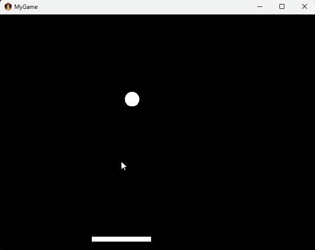
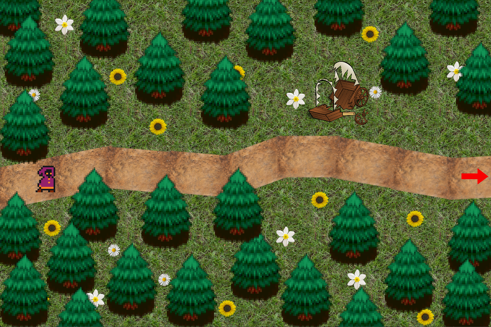
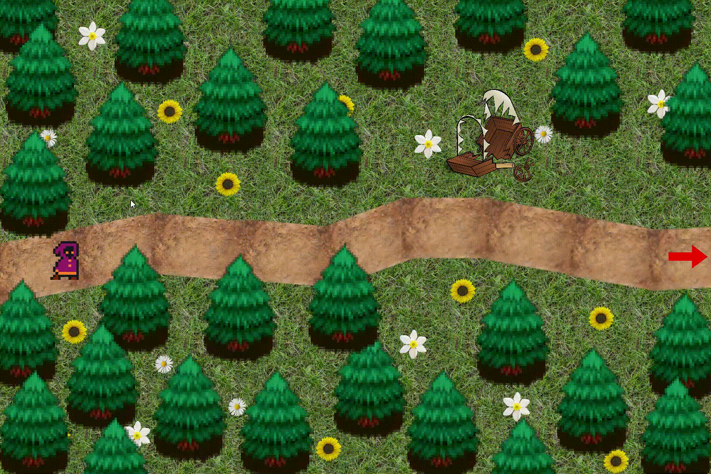
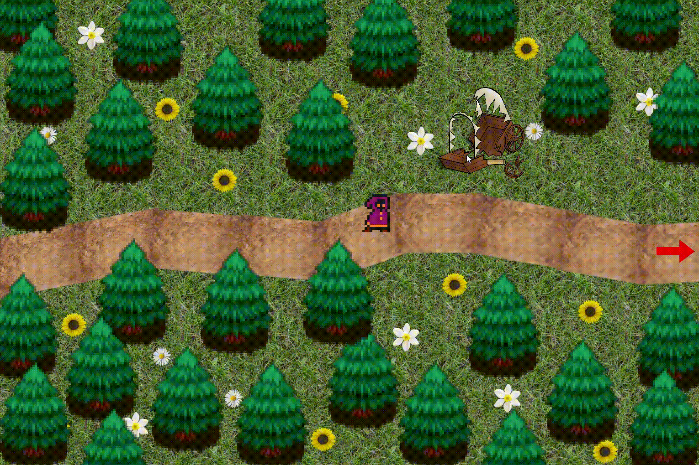
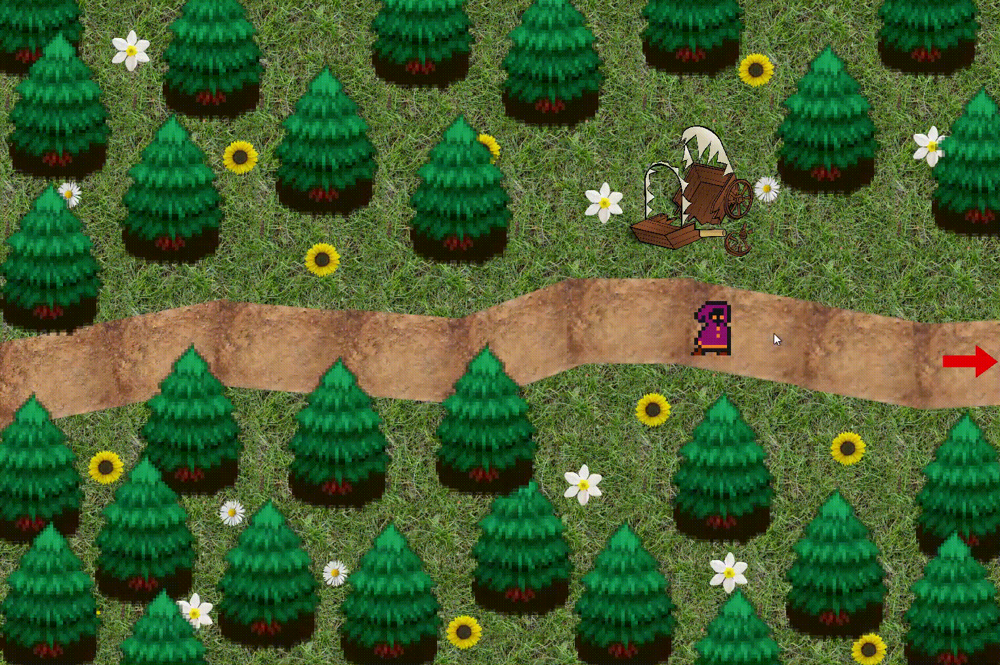
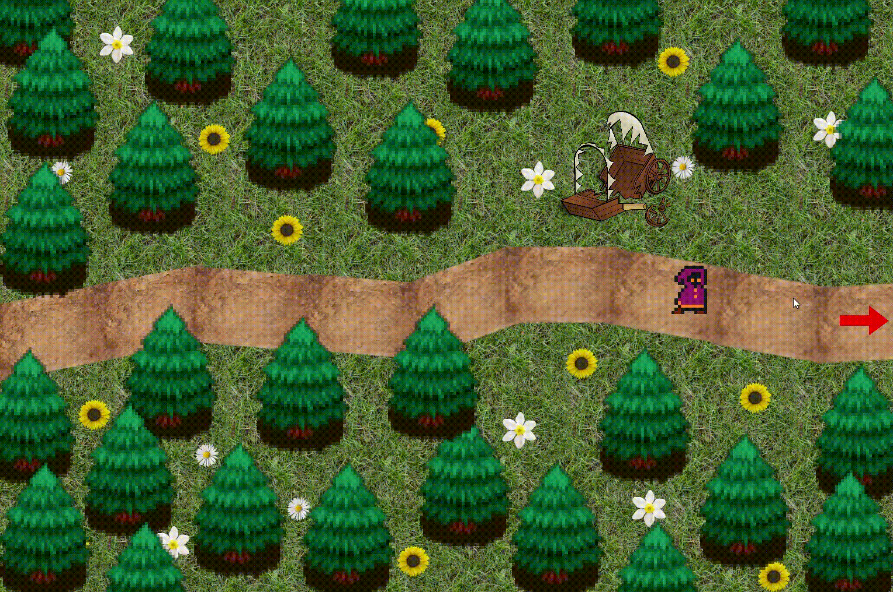
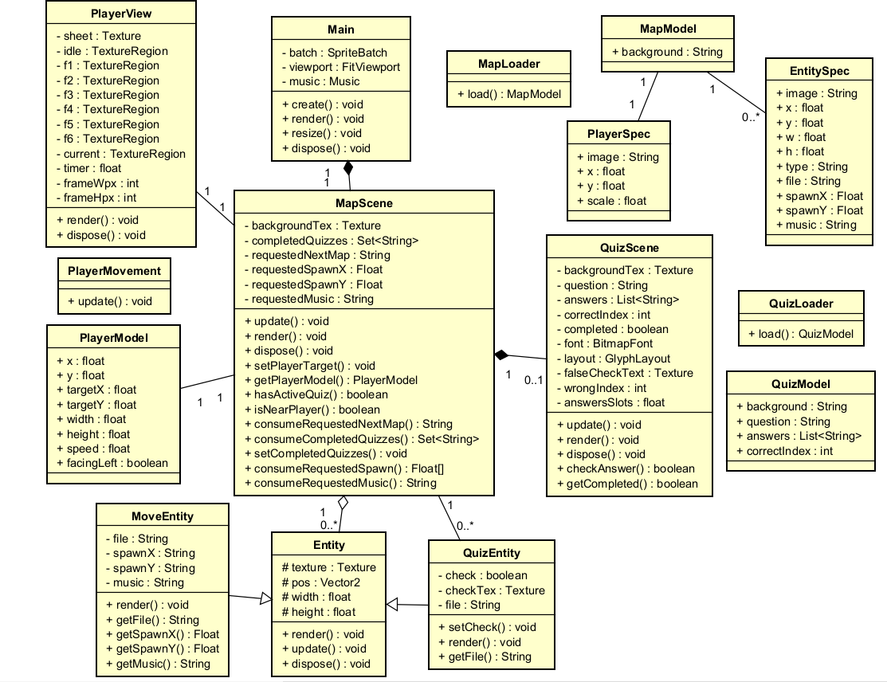

  <h1>RpgPOO 🧙</h1>
  <h3>Gamification - Paradigmas de programação</h3>
  
Universidade Federal de Santa Maria

  
Aluno: Ricardo Facco Pigatto

  
Curso: Sistemas de Informação

# Proposta:
Conforme a proposta do trabalho, RPGPOO é um jogo educativo desenvolvido em Java com o framework LibGDX, que tem como objetivo ensinar
os conceitos básicos de Programação Orientada a Objetos enquanto o jogador explora um mapa interativo formado por quizzes.
O jogador controla um mago em um mundo de RPG, resolvendo perguntas sobre temas vistos em aula, como classes, herança, polimorfismo, 
encapsulamento e abstração. Para vencer, é preciso concluir todos os quizzes espalhados pelo mapa, aprendendo e avançando na história ao mesmo tempo. 
A proposta central do projeto é aplicar os conceitos de orientação a objetos dentro do próprio código do jogo e, 
ao mesmo tempo, explorar novos paradigmas além do básico visto em aula.

# Processo de desenvolvimento:
## Pré-desenvolvimento:
Meu primeiro passo foi assistir a um tutorial disponível na wiki do LibGDX, em que era construido um jogo simples, 
o DropGame, sobre capturar gotas de chuva com um balde. Durante esse processo, percebi que o tipo de jogo criado 
nesse tutorial não era muito parecido com o que eu tinha em mente para o meu jogo, mas foi importante para descobrir 
como funcionava a estrutura do LibGDX, além de coisas mais simples como colocar as texturas do background e outros assets. 

Também fiz alguns testes envolvendo a lógica de movimento do balde. No RpgPOO, eu queria fazer com que o personagem se movesse 
devagar ao destino clicado na tela. Porém, no DropGame, o que mais se aproximava disso era a lógica de clique->teleporte 
do balde, em que ele se movia instantaneamente ao lugar clicado. Deixei isso para resolver depois, na construção do meu 
próprio jogo, pois minha prioridade agora era simplesmente colocar o background e a imagem da personagem. 

Após isso, vi que na wiki da LibGDX tinha outro tutorial, a criação do jogo clássico, Breakout, em que o objetivo é 
"quebrar blocos com a bolinha". Esse jogo é bem parecido com o DropGame, já que também é controlado um elemento da esquerda
pra direita. No desenvolvimento, foi criado métodos para checar colisões da bolinha com o paddle e bordas da tela que, se verdadeiro, invertem 
a velocidade da bolinha, fazendo um "bounce". Não fiz o tutorial inteiro, pois eu já queria começar o desenvolvimento do RpgPOO. 

 
> GIF da execução do jogo, no estágio em que parei o desenvolvimento. 

## Começando o desenvolvimento:
### Implementando mapa
Para começar, decidi simplesmente colocar o background, player e entidades do primeiro mapa do jogo. Fiz isso imitando a maneira como foi feito no
DropGame, programando na classe Main mesmo, então não tive muitas dificuldades. Depois, minha ideia inicial para começar a construir todos os elementos do mapa 
era criar uma classe com nome BuildMap, que leria um arquivo .txt com todas as informações necessárias, como o arquivo do background,
player e entidades. Para o player e entidades, também teria as coordenadas de posição na tela. Mais pra frente no projeto, mudei o arquivo
.txt para arquivo .json, conforme dica da professora. 

Em BuildMap, era feito tudo: carregava dados do .txt (futuramente .json), construia a cena (com player e entidades) e fazia o loop do 
jogo (update e render). Estava funcionando, porém o código estava extenso e percebi que não estava de fato orientado a objetos, que é o tema
principal do trabalho. Por isso, também levei em consideração outra dica da professora: "Procure separar as classes que armazenam dados das 
classes que tratam da interação com o usuário e visual do jogo". 
Com isso, pesquisei e descobri sobre DTO (Data Transfer Objects), uma 
estrutura de dados que é considerada uma boa prática de código, onde é criada estruturas que somente transportam dados, sem métodos e lógica
de jogo, o que é ideal para converter essas informações em JSON. 

Portanto, separei a classe BuildMap em 3 classes: MapModel, MapLoader e MapScene. 
**- MapModel** é um DTO que descreve o mapa: background, player e lista de entidades. Não tem dependência de LibGDX, nem lógica de render, nem input. 
**- MapLoader** é onde ocorre a leitura do arquivo JSON, retornando um MapModel preenchido com todas as informações. Também não tem dependência de LibGDX. 
**- MapScene** é a cena gráfica, recebe um MapModel e carrega tudo: background, player e entidades. Faz também o update (atualiza o estado lógico dos objetos,
por exemplo, a movimentação do player quando for implementada) e render (desenha tudo na tela). 
Com tudo isso feito, o jogo abre e carrega o background, o sprite do jogador (ainda sem lógica de movimento) e as entidades. 

Em MapModel, mais detalhadamente, eu queria que o player e as entidades tivessem características diferentes, já que cada entidade tem seu tipo (trocar_mapa/abrir_quiz)
e o player é mais simples, só com a imagem e escala do asset. Portanto, criei outras duas classes dentro de MapModel, PlayerSpecification e EntitySpecification, 
fazendo assim "nested classes". PlayerSpec tem imagem, onde aparece e escala, enquanto EntitySpec tem isso tudo + tipo. A forma de instanciar objetos com classes nested
é um pouco diferente, então pesquisei mais sobre.

 
> O mago (player) do lado esquerdo, e duas entidades (carroça quebrada e seta vermelha).

### Entidades
Com o mapa sendo carregado, meu próximo passo foi fazer a lógica do player clicar:andar e a lógica das entidades MoveEntity: troca mapa; QuizEntity: abre quiz. 

Na especificação do projeto, eu já tinha definido que iria fazer uma classe Entity, que seria herdada por PlayerEntity, QuizEntity e MoveEntity.
Comecei criando Entity, uma classe que carrega textura e renderiza na tela. Depois criei a classe Player, que herda de Entity, e contêm toda a lógica
de clique:andar e animação de movimento. Também fiz MoveEntity e QuizEntity, no momento sem nada, que também herdam de Entity. 

Novamente, percebi que uma classe minha (nesse caso Player) estava fazendo tudo: carregava a textura e fazia a lógica de movimento e animação. Então apliquei
a mesma estratégia que em BuildMap, e criei as classes PlayerModel, que guarda o estado do player; PlayerMovement, que contêm a lógica de movimento;
PlayerView, renderização e animação. Com isso, a herança de Entity para player não foi mais necessária. 

#### Entidade de Quiz
Depois, decidi fazer a lógica "player chegou perto de QuizEntity -> abre tela de quiz". Para isso, criei QuizModel, QuizLoader e QuizScene.
É estruturado da mesma maneira que as classes de map. 
A lógica de abertura de quiz foi feita em MapScene, no momento em que as entidades são atualizadas a cada frame (em MapScene.update()). Se tal entidade
é da classe QuizEntity e player está perto o suficiente, abre tela de quiz. 

 
> Nesse momento, a tela de quiz só tem o background e fecha ao clicar em qualquer lugar 

Agora era a hora de colocar o texto na tela de quiz. Comecei criando o atributo question em QuizModel, carregando em QuizLoader, e mostrando na tela em
QuizScene. Para isso, usei BitmapFont e GlyphLayout da LibGDX, que literalmente desenha as palavras na tela como se fosse um sprite. 
Depois fiz um ArrayList contendo as respostas, e fiz um vetor com as cordenadas de cada caixa de texto 

Certo. Precisei então colocar a lógica do "clicou na resposta certa -> sai do quiz", e para isso decidi criar uma "hitbox" (entre aspas, pois o que fiz no código está mais para uma gambiarra)
para a resposta correta. Peguei a posição da resposta e verifiquei "clique está dentro da área da caixa de texto?" se sim, acerta e sai. Se não, continua na tela do quiz. 

 
> Acerto ocorre ao clicar na alternativa correta e fecha o quiz. 

Com a tela de quiz feita, faltava só uma coisa pra deixar o código geral do jogo praticamente completo: trocar de mapa ao chegar perto de uma entidade MoveEntity (seta vermelha).
O problema, porém, é que todo o código até agora foi feito com base em um único mapa e um único quiz, então as leituras do JSON do quiz, por exemplo, são feitas
em MapScene, carregando o "quiz1.json" de maneira fixa. 
A primeira mudança que fiz foi colocar o atributo "file" em EntitySpec que está dentro da classe MapModel. Esse file, para entidades do tipo quiz, seria o JSON do quiz da
respectiva entidade. Para entidades do tipo move, seria o JSON do próximo mapa. 

Lembrando, em MapScene atualmente é feito a verificação de "player está perto de uma QuizEntity? se sim, abre quiz1". Eu queria, nesse momento, fazer a lógica de checagem de proximidade 
e abertura do quiz na própria classe QuizEntity, mas acabei não conseguindo pensar em uma maneira de fazer isso, pois eu achei que iria ser complicado demais. Acabei deixando da maneira como está. 
Para conseguir implementar vários quizzes no jogo, fiz a seguinte lógica, em MapScene: 

"Tal entidade é do tipo QuizEntity?" sim -> 
"Tal quiz, que é ligado a tal QuizEntity, já foi consumido?" não -> 
"Player está perto o suficiente?" sim ->  
pega file de tal QuizEntity -> dá load no QuizScene, abrindo a tela de quiz. 

Ok!!! Com isso funcionando, consigo colocar vários quizzes no jogo, não só o quiz1. 

#### Entidade de Move
Para começar a criar a lógica de trocar mapa, fui no JSON do mapa1 e coloquei na entidade "move" um campo "file" apontando pro arquivo do mapa2. Em MapScene,
fiz quase a mesma lógica dos quizzes mas menos complicado: 

Verifica se tal entidade é MoveEntity e se Player está perto o suficiente. 
Caso positivo, registra o pedido de troca de mapa. 

Para esse registro, criei dentro de MapScene um atributo chamado requestedNextMap, que guarda o arquivo do próximo mapa de tal MoveEntity, e um método consumeRequestedNextMap, para ser chamado na Main.
Dentro da Main, em render(), eu chamo o método criado em MapScene e, se de fato exite um request de mapa novo, dou dispose() no mapa que estava carregando, e crio um novo MapScene com o novo mapa do request. 

 
> MoveEntity está trocando mapa!! 

Com isso, queria fazer com que fosse possível voltar ao mapa anterior, então coloquei um MoveEntity no mapa2 voltando para o arquivo mapa1.json. Quando testei, percebi
uma coisa que eu precisava resolver: o player estava aparecendo no spawn original, ou seja, do lado esquerdo da tela, o que não fazia sentido pro contexto visual. 

A primeira ideia que eu tive era de fazer outro arquivo para o mapa1, tipo um "mapa1_back.json" que conteria as coordenadas caso o player estivesse voltando. Mas pensando
um pouco mais era óbvio perceber que ia ser criado vários arquivos a mais, ainda considerando que no meu mapa2 tenho uma opção a mais de caminho. Tinha que ter outro jeito. 

Pensei então que, se tal entidade fosse do tipo "back", eu deveria sobreescrever as coordenadas X e Y do player original de alguma forma. No JSON do mapa2, onde havia a entidade do tipo 
"move", adicionei o campo "back" que se fosse true, buscaria dentro do arquivo mapa1.json as coordenadas do "playerBack". Porém, novamente me dei conta de que em mapas com múltiplos caminhos
eu precisaria ter múltiplos "playerBack", o que deixaria o JSON muito poluído. 

Minha próxima ideia (dessa vez definitiva) foi associar cada MoveEntity (que fosse necessário) a um spawnXY novo, que seria usado pra sobreescrever o spawn do player do mapa anterior.
Para isso, dentro de mapa2.json, na chave entities do tipo "move", criei as chaves "spawnX" e "spawnY", coloquei dentro de EntitySpec em MapModel, também dentro do construtor de MoveEntity,
e leio essas novas chaves, se elas existirem, em MapLoader. 
Em MapScene criei os dois atributos: requestedSpawnX e requestedSpawnY. Se tal entidade é MoveEntity e tem os campos spawnX e spawnY diferente de null, os requested entram no método
consumeRequestedSpawn para serem consumidos na Main, chamando um novo PlayerModel com as coordenadas novas. Essa mecânica é semelhante com o que foi feito para a lógica de trocar mapa. 

*durante esse processo, tive que pesquisar a diferença entre usar float e Float, pois o primitivo float precisa ter um valor, já o objeto Float pode ser null. 

 
> Agora consigo voltar mapas na posição correta. 

## Desenvolvimento final
Para que o jogador vencesse o jogo, era necessário finalizar todos os quizzes. Antes de desenvolver essa lógica, percebi algo que eu deveria resolver:
Ao voltar para um mapa anterior, o jogador pode abrir de novo um quiz já concluído.  
Por isso, na Main criei um HashSet (ao invés de List, pois HashSet garante que não existam elementos repetidos) de String que guarda todos os arquivos de quiz 
que já foram concluídos. Quando cada MapScene é contruído, é verificado esse conjunto para marcar quizzes já resolvidos e impedir que sejam reabertos. 
Dessa forma, no futuro, o jogo só vai ser considerado vencido quando todos os quizzes estiverem registrados no conjunto. 

Depois criei uma condição em MapScene que, se a quantidade de quizzes dentro de completedQuizzes fosse igual a 6, abre um simples background de fim de jogo. 
Futuramente, pretendo criar um botão de jogar de novo, resetando todos os quizzes e voltando o player ao mapa inicial.

Adicionei música ao jogo, com a classe Music da biblioteca LibGDX. Como eu queria colocar mais de uma música, dependendo do mapa em que o jogador está, criei a seguinte lógica: 
Se uma MoveEntity tem "music", troca de música ao trocar mapa. Fiz as músicas serem aclopadas a MoveEntity pois se eu definisse uma música por mapa, ela seria tocada do início toda vez que
o jogador trocasse de mapa. Para isso, fiz da mesma maneira que os requests de troca de mapa e requests de spawn, criando um requestedMusic. Na classe Main, se requestedMusic não é null, para 
a música atual e começa outra.

# Diagrama de classes:
 

# Orientações para execução:

# Resultado final:

# Referências:
https://github.com/elc117/game-2024b-vmferreira - Inspiração para o jogo 
https://libgdx.com - Para dúvidas durante o desenvolvimento 
https://libgdx.com/wiki/start/a-simple-game - DropGame 
https://colourtann.github.io/HelloLibgdx - Breakout 
https://libgdx.com/wiki/utils/reading-and-writing-json - Sobre JSON em LibGDX 
https://youtu.be/KUUT50sgaAs?si=Brwb_jQh7TWFCy20 - Sobre DTO 
https://www.w3schools.com/java/java_hashset.asp - Sobre HashSet 
https://docs.oracle.com/javase/tutorial/java/javaOO/nested.html - Por que usar nested classes? 
https://javadoc.io/doc/com.badlogicgames.gdx/gdx/1.9.5/com/badlogic/gdx/graphics/g2d/GlyphLayout.html - Sobre escrever na tela 
https://libgdx.com/wiki/graphics/2d/fonts/bitmap-fonts - Sobre escrever na tela 
https://stackoverflow.com/questions/16528187/java-should-i-use-float-or-float - Qual a diferença entre float e Float? 
https://libgdx.com/wiki/audio/streaming-music - Música em LibGDX 

# Créditos:
https://greenpixels.itch.io/pixel-art-assets-5 - Player Asset by greenpixels_ 
https://opengameart.org/content/pine-tree-tiles - Pine tree asset by b_o 
https://opengameart.org/content/dark-emperor - Dark Empeor by TheBlackSword 
https://opengameart.org/content/castle-dungeon - Castle Dungeon Tiles by Gary Shaw 
https://opengameart.org/content/js-monster-pack-4-ascent - Monster Pack by JosepghSeraph 
https://opengameart.org/content/desert-tileset-0 - Desert Tileset by MrBeast 
https://opengameart.org/content/cobblestone-tileset - Cobblestone Tileset by Cem Kalyoncu / Textures by Lamoot and West 
https://opengameart.org/content/djinn – Djinn by Svetlana Kushnariova (Cabbit) & Jordan Irwin (AntumDeluge), licensed under OGA-BY 3.0. 
https://opengameart.org/content/saloonpub-assets - Saloon Assets By André D. Louis 
https://opengameart.org/content/boy-with-backpack - Boy with backpack by 
Blind Harpy Gamedev 
https://opengameart.org/content/woodland-fantasy - Woodland Fantasy music by Matthew Pablo 
https://opengameart.org/content/heavy-dungeon - Heavy Dungeon music by MintoDog 
https://opengameart.org/content/the-desert-of-dreams The Desert of Dreams music by Insydnis